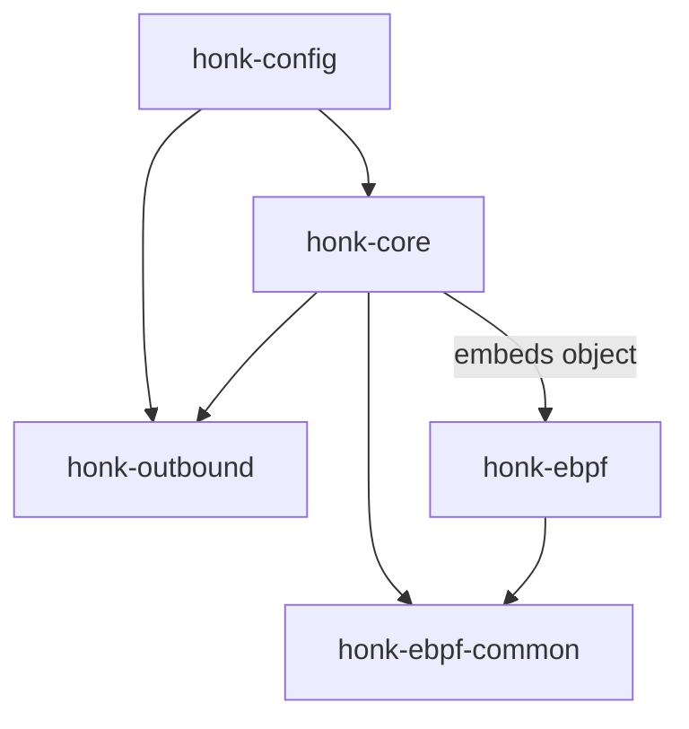
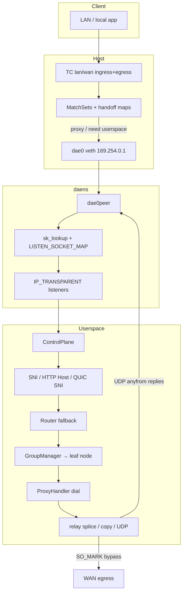

# honk Design Document

> Inspired by [dae](https://github.com/daeuniverse/dae) (eBPF transparent proxy datapath) and [sing-box](https://github.com/SagerNet/sing-box) (outbound groups, protocols, Clash API).
>
> This document describes architecture as implemented in the current tree. Prefer source + this doc over older notes in `plan.md` when they disagree.

## 1. Goals

- Provide a **Linux eBPF transparent proxy** that intercepts LAN/WAN traffic with low overhead.
- Keep a **dae-compatible configuration surface**: the native `.dae` syntax is the primary (and only documented) configuration format.
- Offer a **sing-box-like outbound stack**: multi-protocol handlers, Selector / URLTest / LoadBalance / Fallback groups, health checks, Clash-compatible control API.
- Ship as an **engine-only** binary (`honk-core`). The GraphQL API and Leptos dashboard crates were removed.

## 2. Non-goals (current)

- Full Clash Meta / mihomo feature parity (FakeIP engine, remote rule-sets, full DoH/DoT/DoQ wire protocols).
- REALITY + uTLS client fingerprints (deferred; no mature Rust hooks on rustls).
- Official sing-box multiplex inbound interop for h2mux (framing is sing-mux-like; inner stream handshake differs).
- Windows / macOS transparent proxy.

## 3. Inspiration map

| Area | Primary influence | Notes |
| ------ | ------------------- | -------- |
| TC classify + match_set routing | **dae** | `ROUTING_MAP` MatchSets, LPM tries, domain bitmaps, must/OR/AND |
| `dae0` / `dae0peer` + netns delivery | **dae** | Isolated `daens`, sk_lookup / SockMap, reply rewrite |
| Process matching via cgroup cookie→pid | **dae** | `COOKIE_PID_MAP` |
| DNS learning into domain routing maps | **dae** | Userspace notify → `DOMAIN_ROUTING_MAP` |
| Config section syntax | **dae** | `global { } node { } group { } routing { }` |
| Group policies & nested outbounds | **sing-box** | Selector / URLTest / LB / Fallback, RealTag-style chain |
| TCP/UDP separate URLTest picks | **sing-box** | Tolerance, idle_timeout, interrupt_connections |
| Clash API + external UI download | **sing-box** clashapi | Minimal REST/WS set |
| Protocol/transport details | **sing-box** + daeuniverse **outbound** | SS2022, AnyTLS pool, UoT v2, Hy2/TUIC/Juicity, h2mux |

## 4. Crate layout

```text
crates/
├── honk-config         # Schema + dae-syntax parser + share links
├── honk-ebpf-common    # no_std #[repr(C)] types shared kernel ↔ userspace
├── honk-ebpf           # Kernel programs (excluded from workspace; bpfel-unknown-none)
├── honk-outbound       # Proxy handlers, groups, AliveDialerSet, URLTest
└── honk-core           # Engine binary: control plane, DNS, relay, Clash API, eBPF attach
```



**ABI rule:** any change to map keys/values or constants must update both `honk-ebpf-common` and `honk-ebpf` (and the userspace map writers in `honk-core`).

## 5. High-level data path



### Packet walk (simplified)

1. **TC ingress** on `lan_interface` (L2 or L3 by interface type) parses the packet and runs the eBPF route loop.
2. DNS to port 53 takes a **fast path** (skip expensive match loop) and is redirected to the control plane.
3. Outcomes:
   - `direct + must` → leave on host stack (no redirect).
   - `direct` without must / user outbound / block / control-plane routing → redirect into `dae0` when the outbound is considered alive.
4. In **daens**, `sk_lookup` assigns the flow to transparent TCP/UDP listeners.
5. **Userspace** takes the routing handoff, optionally sniffs domain, falls back to the full `Router`, applies Clash mode override, selects a group leaf, dials, and relays.
6. Dial/probe/DNS-upstream sockets use **`DAE_BYPASS_MARK` (`0x100`)** so eBPF does not re-proxy control-plane traffic.
7. UDP replies use per-endpoint **anyfrom** transparent sockets (dae parity) so source addresses stay correct on the way back through `dae0_ingress`.

> **Note:** Older docs mentioned host `iptables TPROXY` on the bridge master as the primary path. The live path is **TC redirect + daens + sk_lookup**. Listeners are still `IP_TRANSPARENT`. Cleanup scripts may still remove leftover legacy iptables rules.

## 6. eBPF design

### Programs

| Program family | Hook | Role |
| ---------------- | ------ | ------ |
| `lan_ingress_l2/l3` | TC ingress LAN | Classify, route, redirect, TX stats |
| `wan_ingress_l2/l3` | TC ingress WAN | WAN-side / reverse path (dual-homed) |
| `tproxy_lan/wan_egress_*` | TC egress | Local-originated traffic + reverse conn state |
| `dae0_ingress` | TC ingress dae0 | Reply rewrite + RX stats |
| `dae0peer_ingress` | TC ingress dae0peer | Delivery assist in daens |
| `tproxy_sk_lookup` | sk_lookup | Map flows onto listeners |
| cgroup sock/connect/sendmsg | cgroup | Cookie → pid/comm for `pname` rules |

### Key maps

| Map | Role |
| ----- | ------ |
| `ROUTING_MAP` + `ROUTING_META_MAP` | MatchSet array + L4/IP-version bitmaps; two-phase publish |
| `DEST/SOURCE/MAC_LPM_ROUTING_MAP` | LPM tries for CIDR/MAC |
| `DOMAIN_ROUTING_MAP` | IP → domain-rule bitmaps (DNS-learned) |
| `ROUTING_HANDOFF_MAP` | Tuple → userspace handoff |
| `REDIRECT_TRACK` / `CONN_STATE_MAP` | Redirect + conntrack state |
| `OUTBOUND_CONNECTIVITY_MAP` | Alive bits pushed from userspace health checks |
| `OUTBOUND_STATS` | Per-CPU tx/rx packets/bytes per outbound |
| `LISTEN_SOCKET_MAP` | SockMap of transparent listeners |
| `EVENT_RINGBUF` | Overflow events drained to tracing |

### Reserved outbound indices

Aligned with dae-core:

```text
0 Direct | 1 Block | 2+ user groups
0xFC MustRules | 0xFD ControlPlaneRouting | 0xFE OR | 0xFF AND
```

### Domain routing split brain

- **At SYN time**, pure domain rules often cannot match without a prior DNS learn or userspace sniff.
- DNS answers update `DOMAIN_ROUTING_MAP` so subsequent TCP can match in eBPF.
- `direct` without `must` is intentionally sent to userspace so SNI/HTTP Host can refine the route (dae-like).
- TCP sniff: TLS ClientHello SNI + HTTP Host. QUIC Initial SNI decryption is implemented for UDP domain routing without DNS learning.

## 7. Userspace control plane

`honk-core` owns:

| Subsystem | Responsibility |
| ----------- | ---------------- |
| Netns / veth setup | Create `daens`, `dae0`/`dae0peer`, addresses, policy routing |
| `EbpfBackend` | Load/attach programs, push maps, stats, mock backend for tests |
| Accept loop | Transparent TCP/UDP, original destination, handoff take |
| `Router` | Full condition set (domain/geoip/geosite/process/…) |
| Sniffing | TCP SNI/Host, QUIC SNI |
| DNS | Cache, routing, forwarder, optional SQLite persist |
| Groups / dial | Via `honk-outbound` |
| Relay | `splice(2)` zero-copy when both ends are plain TCP; else `copy_bidirectional`; UDP bridges |
| Clash API | Optional axum server |
| Cache DB | Selector choices, mode, optional DNS answers |
| Subscriptions | Fetch + periodic merge without rewriting the config file |

### Dial modes (`global.dial_mode`)

| Mode | Behavior |
| ------ | ---------- |
| `ip` | Resolve locally; dial by IP; sniffing off |
| `domain` | Sniff domain; verify it resolves to dest IP; dial with domain |
| `domain+` | Like `domain` but skip reality check of sniffed name |
| `domain++` | Force sniff and re-route on sniffed domain |

## 8. Outbound stack

### Handlers (`honk-outbound`)

Registered protocols: Direct, Block, SOCKS5, Shadowsocks (+ 2022), SSR, Trojan, Trojan-Go, VMess, VLESS, Hysteria2, TUIC, Juicity, AnyTLS.

Shared layers:

- `transport.rs` — TCP → optional TLS → WS / gRPC
- `mux.rs` — h2mux when `node.mux = true` (not smux/yamux)
- `quic.rs` — shared quinn client for Hy2 / TUIC / Juicity
- `tls.rs` — rustls helpers

### Groups

Policies (sing-box shaped):

| Policy | Behavior |
| -------- | ---------- |
| **Selector** | Manual pin; Clash API + cache persistence |
| **URLTest** | Lowest latency + tolerance vs the incumbent's current measured latency (sing-box parity); separate TCP/UDP selections; idle sleep; dial failure clears the node's latency history so the next connection re-selects; optional per-group `check_url` probed and ranked independently of the global target |
| **LoadBalance** | Per-group round-robin among alive members |
| **Fallback** | First alive in declaration order; sticky until death |

Nested groups (`groups` field) flatten recursively (depth ≤ 8) to a single leaf on the dial path.

### Health (`AliveDialerSet`)

- Per-node states: TCP / DnsUDP / DataUDP × v4/v6
- Concurrent probes (default batch 10), recovery hysteresis, grace period, exponential backoff (deep-backoff nodes keep probing on the slow max-cooldown cadence — never a full stop)
- TCP: HTTP HEAD or raw connect; UDP: DNS query through the node’s own `dial_udp`
- Pushes connectivity into eBPF so dead outbounds are not redirected

## 9. DNS design

```text
Client :53 → eBPF DNS fast path (redirect, no full route loop)
          → DnsController → cache → DnsRouter → UpstreamPool
          → answer + optional DOMAIN_ROUTING_MAP update
          → anyfrom reply
```

- Userspace cache only today (no kernel DNS answer cache map yet).
- Upstream protocols: UDP/TCP/DoT/DoH/DoQ/DoH3 are all implemented (`honk-core/src/dns/transport/`, pooled sessions with one retry after invalidation).
- Optional `outbound` on an upstream routes queries through a proxy node/group (anti-pollution intent; UDP+proxy tunnels as TCP-DNS because the SOCKS5-UDP path is still incomplete, and DoQ/DoH3 are direct-only).

Resolution defaults to `both`: an omitted strategy forwards eligible A and AAAA
queries concurrently. `preferipv4`/`preferipv6` still query both families and
only suppress the non-preferred answer when the preferred family has usable
records; `ipv4only`/`ipv6only` do not forward the ineligible family. Bootstrap
fallback runs once, only when every eligible family is unusable, and its result
is filtered by the same eligibility set.

Cache and singleflight keys include the ingress profile, routing policy, scope,
and operation. Requests that are not cacheable or coalescable bypass both
layers; cancellation releases their flight state. DNS persistence uses an
`HDNS` v2 record under the `dns:v2:` namespace. Writes are bounded and epoch
fenced: a flush discards older queued epochs before writing the newest state,
while stale, corrupt, version-mismatched, or policy-mismatched rows are
skipped on restore. A rollback to a pre-v2 binary therefore ignores v2 rows;
they may remain in `cache.db` and do not change the old runtime's behavior.

Runtime reloads publish a new coherent generation. Existing leases finish on
the old generation while new requests use the replacement; retirement closes
stalled generations at the deadline and caps retained generations. Pooled
transports single-flight initialization and close idle sessions exactly once.
Cache, flight, persistence, runtime, transport, projection, and outcome
diagnostics use independent monotonic atomic counters. An internal scrape
loads each counter without blocking request writers; it is best-effort rather
than one coherent instant, so cross-counter invariants must not be inferred.
Structured failure logs expose only bounded `error_kind` classes
(forwarder, persistence, projection, and transport) plus bounded fields such
as the transport label; they omit query names, upstream addresses, and
free-form error payloads. This adds no public DNS metrics endpoint,
configuration key, or API.

## 10. Clash API

Enabled when `experimental.clash_api.external_controller` is non-empty.

Core surface: `/version`, `/configs`, `/proxies`, delay endpoints, `/rules`, `/connections`, `/traffic`, `/stats`, `/logs`, `/dns/query`, cache flush, `/providers/proxies`, external UI auto-download (Yacd-meta).

Auth: `Authorization: Bearer` or `?token=` (percent-decoded).

## 11. Runtime privileges

- **root** required for real eBPF: load BPF, TC/cgroup/sk_lookup attach, netns, veth, transparent bind, sysctl.
- Docker: `--privileged --network=host --pid=host` and mount `/sys`.
- Tests use `MockEbpfBackend` / `--mock-ebpf` without privileges.

## 12. Security notes

- Treat config files and BPF objects as **privileged input**.
- Clash API has **no TLS**; bind to localhost or put a reverse proxy in front; set a strong `secret`.
- Bypass mark must stay on control-plane dial sockets or the gateway will loop its own traffic.

## 13. Authorship (design process)

- **eBPF datapath** (`honk-ebpf`, `honk-ebpf-common`, attach/maps path in `honk-core`): primary human design, implementation review, and verification focus of the project maintainer.
- **Remaining subsystems** (config parsers, outbound handlers, groups/health, DNS userspace, Clash API, much of the control-plane glue): largely authored with AI assistance; the maintainer performed **partial code review** rather than line-by-line ownership.
- See the root README for the same disclosure in project overview form.

## 14. Related docs

- [Configuration](./configuration.en.md)
- [Component reference](./components.en.md)
- [DNS canary and rollback runbook](./dns-rollout.en.md)
- [AGENTS.md](../AGENTS.md) — agent-oriented layout notes
