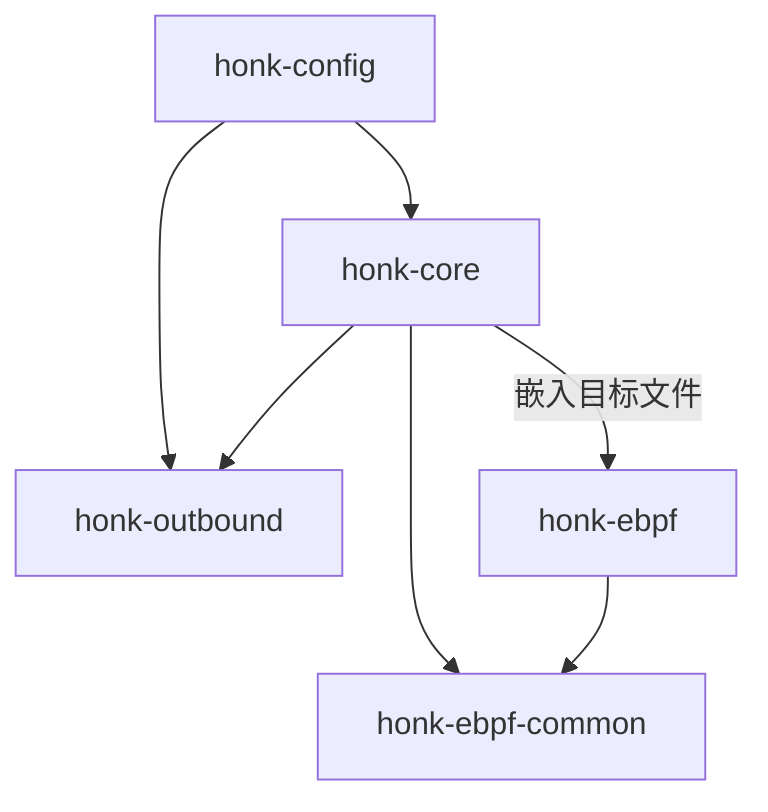
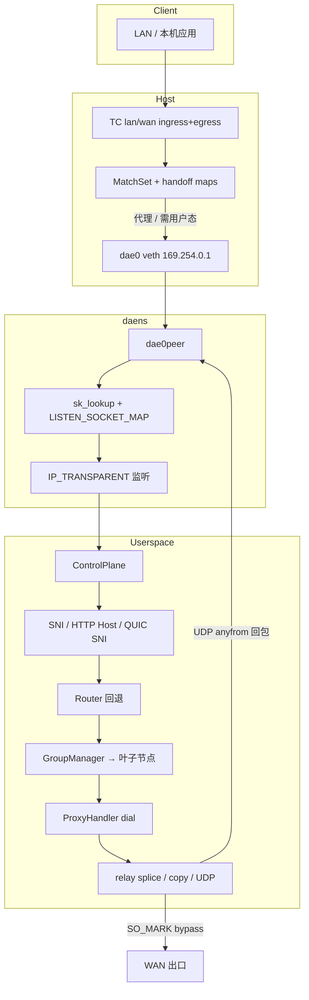

# honk 设计文档

> 项目受 [dae](https://github.com/daeuniverse/dae)（eBPF 透明代理数据面）与 [sing-box](https://github.com/SagerNet/sing-box)（出站组、协议栈、Clash API）启发。
>
> 本文描述**当前代码树中的实现**。若与 `plan.md` 中的旧笔记冲突，以源码与本文为准。

## 1. 目标

- 在 Linux 上提供**低开销的 eBPF 透明代理**，拦截 LAN/WAN 流量。
- 保留 **dae 兼容的配置面**：原生 `.dae` 语法是唯一文档化的配置格式。
- 提供 **类 sing-box 的出站栈**：多协议 Handler、Selector / URLTest / LoadBalance / Fallback 组、健康检查、Clash 兼容控制 API。
- 以**纯引擎二进制**（`honk-core`）交付。GraphQL API 与 Leptos 面板 crate 已移除。

## 2. 非目标（当前）

- 完整 Clash Meta / mihomo 能力对等（完整 FakeIP 引擎、远程 rule-set、完整 DoH/DoT/DoQ 线协议）。
- REALITY + uTLS 客户端指纹（延期；rustls 缺少成熟 hook）。
- 与官方 sing-box multiplex inbound 的完整互通（h2mux 帧接近 sing-mux，内层握手不同）。
- Windows / macOS 透明代理。

## 3. 灵感来源对照

| 领域 | 主要来源 | 说明 |
| ------ | ---------- | ------ |
| TC 分类 + match_set 路由 | **dae** | `ROUTING_MAP` MatchSet、LPM、域名位图、must/OR/AND |
| `dae0` / `dae0peer` + netns 投递 | **dae** | 隔离 `daens`、sk_lookup / SockMap、回程改写 |
| cgroup cookie→pid 进程匹配 | **dae** | `COOKIE_PID_MAP` |
| DNS 学习写入域名路由图 | **dae** | 用户态 notify → `DOMAIN_ROUTING_MAP` |
| 分段配置语法 | **dae** | `global { } node { } group { } routing { }` |
| 组策略与嵌套出站 | **sing-box** | Selector / URLTest / LB / Fallback、RealTag 风格链 |
| TCP/UDP 独立 URLTest 选择 | **sing-box** | tolerance、idle_timeout、interrupt_connections |
| Clash API + 外部 UI 下载 | **sing-box** clashapi | 最小 REST/WS 集合 |
| 协议/传输细节 | **sing-box** + daeuniverse **outbound** | SS2022、AnyTLS 池、UoT v2、Hy2/TUIC/Juicity、h2mux |

## 4. Crate 划分

```text
crates/
├── honk-config         # 配置 schema + 解析器 + 分享链接
├── honk-ebpf-common    # no_std #[repr(C)] 内核/用户态共享类型
├── honk-ebpf           # 内核程序（不在 workspace 内；bpfel-unknown-none）
├── honk-outbound       # 协议 Handler、组、AliveDialerSet、URLTest
└── honk-core           # 引擎：控制面、DNS、中继、Clash API、eBPF 挂载
```



**ABI 规则：** 修改 map 键值或常量时，必须同步更新 `honk-ebpf-common`、`honk-ebpf` 以及 `honk-core` 中的用户态 map 写入逻辑。

## 5. 高层数据路径



### 报文路径（简）

1. 在 `lan_interface` 上的 **TC ingress**（按接口类型选 L2/L3）解析报文并跑 eBPF 路由环。
2. 目的端口 53 的 DNS 走**快路径**（跳过昂贵 match 环），重定向到控制面。
3. 结果：
   - `direct + must` → 留在主机协议栈（不 redirect）。
   - 非 must 的 `direct` / 用户出站 / block / 控制面路由 → 在出站存活时 redirect 进 `dae0`。
4. 在 **daens** 中，`sk_lookup` 将流指派到透明 TCP/UDP 监听套接字。
5. **用户态**取 handoff，可选嗅探域名，必要时走完整 `Router`，应用 Clash 模式覆盖，选组叶子，拨号并中继。
6. 拨号/探测/DNS 上游套接字打上 **`DAE_BYPASS_MARK`（`0x100`）**，避免被 eBPF 再次代理。
7. UDP 回包使用每 endpoint 的 **anyfrom** 透明套接字（对齐 dae），经 `dae0_ingress` 回写到客户端。

> **说明：** 旧文档曾写主机桥上 `iptables TPROXY` 为主路径。当前实现是 **TC redirect + daens + sk_lookup**。监听仍为 `IP_TRANSPARENT`。清理脚本可能仍会删除历史遗留的 iptables 规则。

## 6. eBPF 设计

### 程序

| 程序族 | 挂载点 | 作用 |
| -------- | -------- | ------ |
| `lan_ingress_l2/l3` | TC ingress LAN | 分类、路由、redirect、TX 统计 |
| `wan_ingress_l2/l3` | TC ingress WAN | WAN / 回程（双臂时） |
| `tproxy_lan/wan_egress_*` | TC egress | 本机发起流量 + 反向连接状态 |
| `dae0_ingress` | TC ingress dae0 | 回程改写 + RX 统计 |
| `dae0peer_ingress` | TC ingress dae0peer | daens 内投递辅助 |
| `tproxy_sk_lookup` | sk_lookup | 流映射到监听套接字 |
| cgroup sock/connect/sendmsg | cgroup | cookie → pid/comm，供 `pname` 规则 |

### 关键 map

| Map | 作用 |
| ----- | ------ |
| `ROUTING_MAP` + `ROUTING_META_MAP` | MatchSet 数组 + L4/IP 版本位图；两阶段发布 |
| `DEST/SOURCE/MAC_LPM_ROUTING_MAP` | CIDR/MAC 的 LPM |
| `DOMAIN_ROUTING_MAP` | IP → 域名规则位图（DNS 学习） |
| `ROUTING_HANDOFF_MAP` | 五元组 → 用户态 handoff |
| `REDIRECT_TRACK` / `CONN_STATE_MAP` | redirect 与 conntrack |
| `OUTBOUND_CONNECTIVITY_MAP` | 用户态健康检查推送的存活位 |
| `OUTBOUND_STATS` | 每出站 per-CPU tx/rx 包/字节 |
| `LISTEN_SOCKET_MAP` | 透明监听 SockMap |
| `EVENT_RINGBUF` | 溢出事件 → 用户态 tracing |

### 保留出站索引

与 dae-core 对齐：

```text
0 Direct | 1 Block | 2+ 用户组
0xFC MustRules | 0xFD ControlPlaneRouting | 0xFE OR | 0xFF AND
```

### 域名路由的「双路径」

- **SYN 时刻**，若无 DNS 学习或用户态嗅探，纯域名规则往往无法命中。
- DNS 应答会更新 `DOMAIN_ROUTING_MAP`，后续 TCP 可在 eBPF 内匹配。
- 非 `must` 的 `direct` 会刻意进用户态，以便 SNI/HTTP Host 精修路由（dae 风格）。
- TCP 嗅探：TLS ClientHello SNI + HTTP Host。QUIC Initial SNI 解密已实现，用于无 DNS 学习时的 UDP 域名路由。

## 7. 用户态控制面

`honk-core` 负责：

| 子系统 | 职责 |
| -------- | ------ |
| Netns / veth | 创建 `daens`、`dae0`/`dae0peer`、地址与策略路由 |
| `EbpfBackend` | 加载/挂载程序、写 map、统计；测试用 Mock |
| Accept 循环 | 透明 TCP/UDP、原始目的地址、handoff |
| `Router` | 完整条件集（域名/geoip/geosite/进程/…） |
| 嗅探 | TCP SNI/Host、QUIC SNI |
| DNS | 缓存、路由、转发、可选 SQLite 持久化 |
| 组 / 拨号 | 经由 `honk-outbound` |
| 中继 | 双端裸 TCP 时 `splice(2)`；否则 `copy_bidirectional`；UDP bridge |
| Clash API | 可选 axum 服务 |
| Cache DB | Selector 选择、模式、可选 DNS 应答 |
| 订阅 | 拉取 + 周期合并，不回写配置文件 |

### 拨号模式（`global.dial_mode`）

| 模式 | 行为 |
| ------ | ------ |
| `ip` | 本地解析后按 IP 拨号；关闭嗅探 |
| `domain` | 嗅探域名；校验解析结果与目的 IP；按域名拨号 |
| `domain+` | 类似 `domain`，但跳过嗅探域名的真实性校验 |
| `domain++` | 强制嗅探，并按嗅探域名重新路由 |

## 8. 出站栈

### Handler（`honk-outbound`）

已注册：Direct、Block、SOCKS5、Shadowsocks（含 2022）、SSR、Trojan、Trojan-Go、VMess、VLESS、Hysteria2、TUIC、Juicity、AnyTLS。

共享层：

- `transport.rs` — TCP → 可选 TLS → WS / gRPC
- `mux.rs` — `node.mux = true` 时 h2mux（无 smux/yamux）
- `quic.rs` — Hy2 / TUIC / Juicity 共用 quinn 客户端
- `tls.rs` — rustls 辅助

### 组

策略（sing-box 风格）：

| 策略 | 行为 |
| ------ | ------ |
| **Selector** | 手动固定；Clash API + cache 持久化 |
| **URLTest** | 最低延迟 + tolerance（以现任节点的当前实测延迟为基准，与 sing-box 一致）；TCP/UDP 独立选择；空闲休眠；拨号失败立即清除该节点延迟历史，下一条连接即刻重选；可选 per-group `check_url`，与全局目标独立探测与排序 |
| **LoadBalance** | 组内存活成员轮询 |
| **Fallback** | 声明顺序第一个存活；粘性直到死亡 |

嵌套组（`groups` 字段）递归展开（深度 ≤ 8），拨号路径最终只落到一个叶子节点。

### 健康检查（`AliveDialerSet`）

- 每节点状态：TCP / DnsUDP / DataUDP × v4/v6
- 并发探测（默认批次 10）、恢复滞后、宽限期、指数退避（深度退避节点仍以 max_cooldown 慢速节奏继续探测，永不完全停止）
- TCP：HTTP HEAD 或裸连接；UDP：经节点自身 `dial_udp` 发 DNS 查询
- 将连通性推入 eBPF，避免把流量 redirect 到已死出站

## 9. DNS 设计

```text
客户端 :53 → eBPF DNS 快路径（redirect，不做完整路由环）
           → DnsController → 缓存 → DnsRouter → UpstreamPool
           → 应答 + 可选更新 DOMAIN_ROUTING_MAP
           → anyfrom 回包
```

- 当前仅有用户态缓存（尚无内核 DNS 应答 cache map）。
- 上游协议：UDP/TCP/DoT/DoH/DoQ/DoH3 均已实现（`honk-core/src/dns/transport/`，会话池化，失效后重试一次）。
- 上游可选 `outbound`，经代理节点/组发出查询（防污染）；因 SOCKS5-UDP 路径不完整，UDP+代理隧道化为 TCP-DNS，DoQ/DoH3 仅支持直连。

## 10. Clash API

当 `experimental.clash_api.external_controller` 非空时启用。

核心接口：`/version`、`/configs`、`/proxies`、delay、`/rules`、`/connections`、`/traffic`、`/stats`、`/logs`、`/dns/query`、缓存清理、`/providers/proxies`、外部 UI 自动下载（Yacd-meta）。

鉴权：`Authorization: Bearer` 或 `?token=`（已做 percent-decode）。

## 11. 运行时权限

- 真实 eBPF 需要 **root**：加载 BPF、TC/cgroup/sk_lookup 挂载、netns、veth、透明 bind、sysctl。
- Docker：`--privileged --network=host --pid=host`，并挂载 `/sys`。
- 测试使用 `MockEbpfBackend` / `--mock-ebpf`，无需特权。

## 12. 安全注意

- 配置文件与 BPF 目标文件视为**特权输入**。
- Clash API **无 TLS**；请绑定本机或前置反向代理，并设置强 `secret`。
- 控制面拨号套接字必须保留 bypass mark，否则网关会把自己的流量再次代理形成环路。

## 13. 作者与分工说明

- **eBPF 数据面**（`honk-ebpf`、`honk-ebpf-common`，以及 `honk-core` 中的挂载/map 路径）：由维护者重点参与设计、校验与实现。
- **其余子系统**（配置解析、出站协议、组/健康检查、用户态 DNS、Clash API、大量控制面粘合代码）：主要由 AI 辅助编写；维护者做了**部分代码 review**，并非逐行全量把关。
- 项目概览中的相同声明见根目录 README。

## 14. 相关文档

- [配置说明](./configuration.zh.md)
- [组件详细配置](./components.zh.md)
- [AGENTS.md](../AGENTS.md) — 面向 Agent 的仓库说明
- [plan.md](../plan.md) — 历史未完成计划（可能落后于代码）
